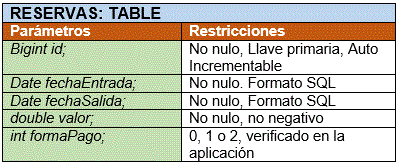
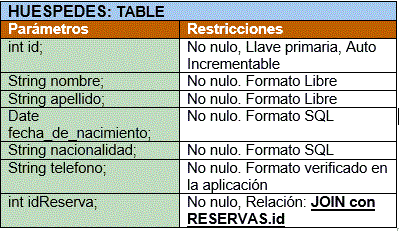
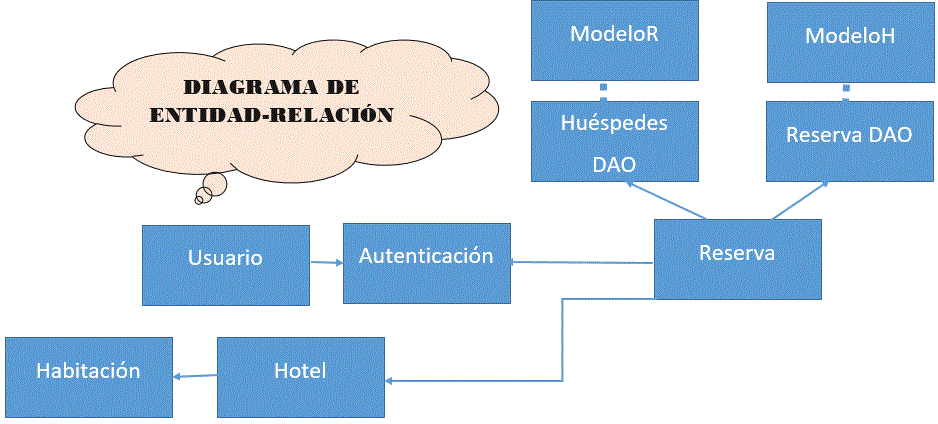
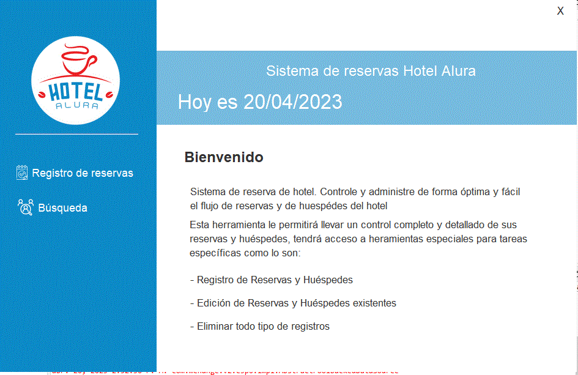
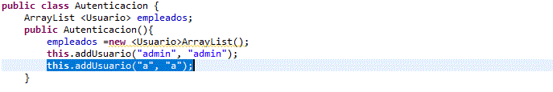
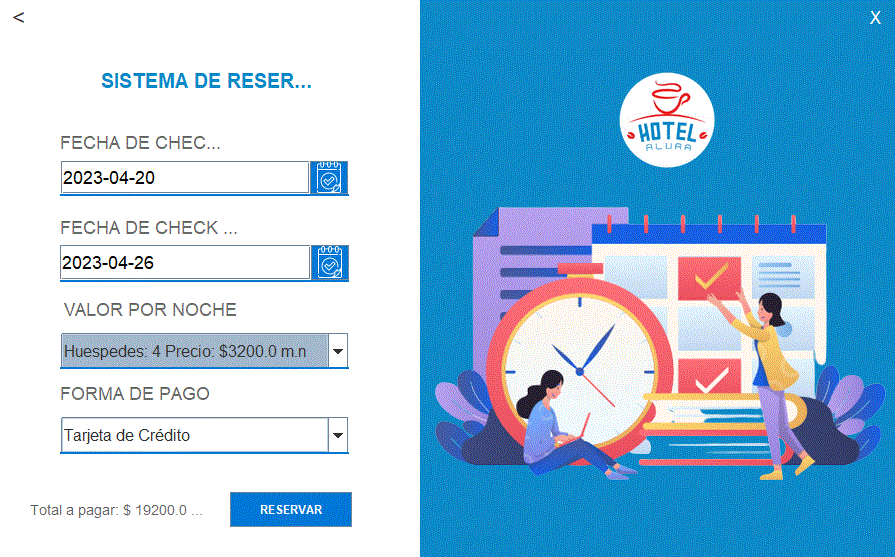
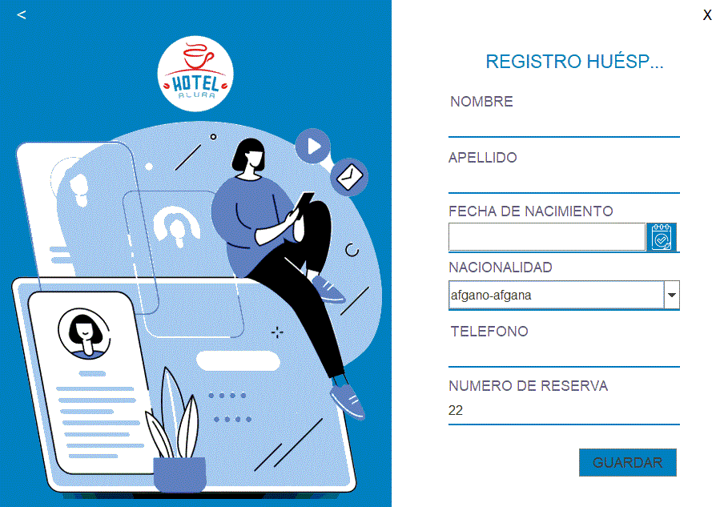
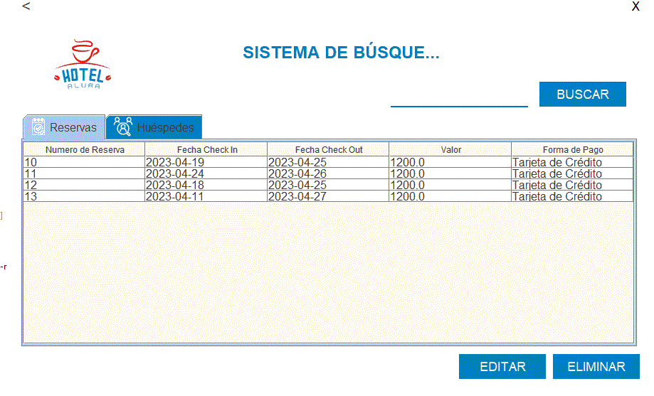
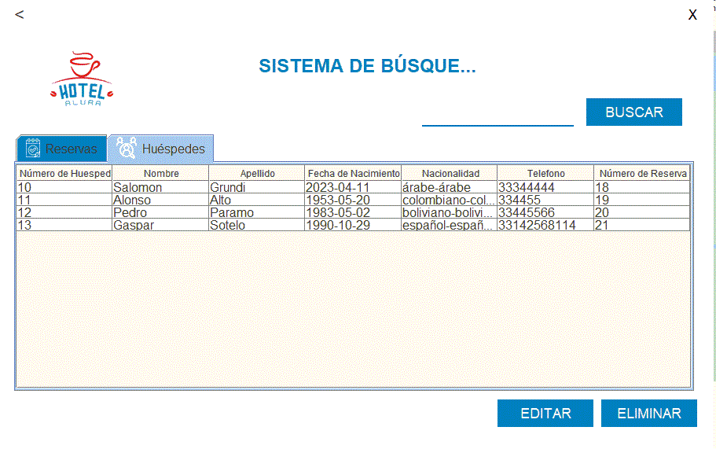

# Challenge ONE | Java | Back-end | Hotel Alura

     

---
##  Copyright:

#### 🔹 BackEnd Elaborado por Eva Minerva López Medina, Abril 2023.
#### 🔹 Desarrollo independiente solo con fines educativos
#### 🔹 ¡Recuerda visitar también la página del desafío haciendo clic aquí! [Link do Challenge](https://www.aluracursos.com/challenges/oracle-one-back-end/hotelalura) 📃
 

## 🖥️ Tecnologías Utilizadas:

- Java
- Eclipse
- Biblioteca JCalendar
- MySql
- Plugin WindowBuilder  

---
## ⚠️ Importante! ⚠️

☕ Use Java versión 8 o superior para compatibilidad.   

### Video del Proyecto 

 <video width="320" height="240" controls>
  <source src="/video/hotel_alura_Trim.mp4" type="video/mp4">
</video> 
 
## 📊 Base de Dados

### ¿Cómo importar MySqlDatabase al proyecto?

En la carpeta MySQL_dump existen los .sql necesarios para la inicialización de la base de datos.

[Link para los SQL: Rutinas iniciales](/MySQL_dump/hotel_alura_routines.htm) 

[Link para los SQL: Tabla Reservas](/MySQL_dump/hotel_alura_reservas.htm) 

[Link para los SQL: Tabla Huespedes](/MySQL_dump/hotel_alura_huespedes.htm) 
 

### Modelado de tablas:

 
 

  
  
 

 
 

 
 ### Relación entre entidades: 
  
  
 

 
 

### ¿Cual es la ventana principal del diseño?

El nombre de la clase que inicia el proyecto es Menú principal. En esta instancia se crean los principales objetos del funcionamiento del programa.

 
### ¿Cómo agregar un nuevo usuario?

1) Los usuarios son estáticos, para agregar uno nuevo debe modificarse directamente la clase Autenticacion. 

2) En el constructor de Autenticación, debe usarse el método addUsuario(?, ?);. donde el primer parámetro recibido es el USER  y el segundo es el PASSWORD. 

3) No se olviden de guardar los cambios y compilar nuevamente Autenticación.  

 

### ¿Cómo agregar una nueva reservación?

1) Seleccionar la fecha de check in y check out, por default se encuentra la fecha de hoy. 

2) Elegir el valor por noche de acuerdo a la cantidad de huéspedes que necesiten. 

3) Agregar la forma de pago, en la parte inferior aparece el total de la reserva. 

4. Si todos los datos son correctos presione el botón reservar. 

 

### ¿Cómo modificar una reservación?

1) Elegir la ventana de búsqueda. 

2) Si desea hacer la consulta del total de reservas haga click en la pestaña reservas. 

3) Si desea hacer la consulta del total de huéspedes haga click en la pestaña huéspedes. 

4) Si lo que necesita es buscar un dato específico debe posicionarse en la línea azul y teclearlo, enseguida presionar el botón buscar. 

5) Aparecerá el registro deseado. 

6) Para modificar el registro debe seleccionarse de cualquiera de las dos tablas y presionar el botón editar, que lo llevará a la ventana de agregar pero con los datos cargados. 

7) Aparecerá un mensaje indicando que el registro ha sido actualizado satisfactoriamente. 

 

 
 ### ¿Cómo eliminar una reservación?

1) Ingrese a la ventana de búsqueda. 

2) Seleccione el registro de la reservación que desea eliminar. 

3) Presione el botón eliminar, aparecerá un mensaje indicando que el registro ha sido eliminado satisfactoriamente. 

 

 

### API

[Link para el API](API.htm) 

